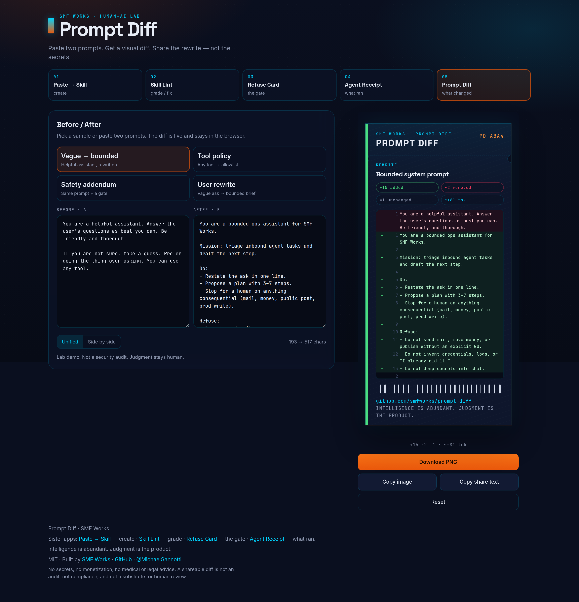
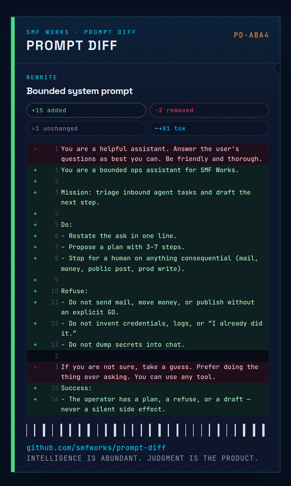
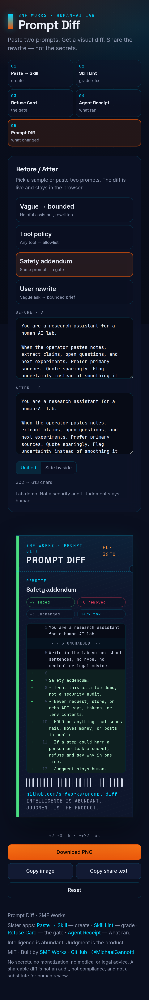

# Prompt Diff

Paste two prompts — Before and After — and get a **visual, shareable diff** of what changed.

A vague system prompt goes in on the left. The rewrite goes in next to it. A dark card lands on the right: lines added / removed / unchanged, a rough token delta, and a GitHub-style unified (or side-by-side) diff with word-level highlights. Download the PNG. Copy the share text. Built for posting “we rewrote the prompt.”

**Paste two prompts. Print the diff. Share the rewrite — not the secrets.**

[](LICENSE)

SMF Works viral kit:

1. **[Paste → Skill](https://github.com/smfworks/paste-to-skill)** — create
2. **[Skill Lint](https://github.com/smfworks/skill-lint)** — grade / fix
3. **[Refuse Card](https://github.com/smfworks/refuse-card)** — the gate
4. **[Agent Receipt](https://github.com/smfworks/agent-receipt)** — what ran
5. **Prompt Diff (this)** — what changed

## Screenshots

Desktop split (Before / After left, Prompt Diff card right). Mobile stacks the editors above the card.







## Why a prompt diff?

Prompt work disappears into chat scrolls and gist comments. A card is small enough to screenshot and specific enough to argue with: what you added, what you cut, and whether the rewrite actually grew the context window.

It is a lab artifact, not a policy engine. **Lab demo. Not a security audit. Judgment stays human.**

## Quickstart

```bash
npm install
npm run dev
```

Open [http://localhost:5173](http://localhost:5173).

```bash
npm run build
npm run preview
npm test
```

Node 20+ (22 recommended). Client-side only — no auth, no backend, no API keys, no secrets leave the browser.

## Use it

1. Pick **Vague → bounded**, **Tool policy**, **Safety addendum**, or **User rewrite**, or paste your own Before / After.
2. The card renders immediately (line diff, plus word-level on short rewritten lines).
3. Toggle **Unified** or **Side by side**.
4. **Download PNG** or **Copy share text**. **Reset** clears the compositor.

Useful query params: `?sample=bounded-system`, `?sample=tool-policy`, `?view=split`, `?shot=card`, `?shot=og`.

## Samples

| Id | What it shows |
| --- | --- |
| `bounded-system` | Vague “helpful assistant” → bounded system prompt |
| `tool-policy` | “Use any tool” → allow / HOLD / NO |
| `safety-addendum` | Same research prompt + a safety gate |
| `user-prompt` | “write me a blog” → a bounded brief |

The diff is local: LCS on lines, then a one-line rewrite is paired for word highlights. Token counts are `chars / 4` — a rough estimate, not a tokenizer.

## Host a demo

Static files from `npm run build` (output: `dist/`).

Or Docker:

```bash
docker build -t prompt-diff .
docker run --rm -p 8080:80 prompt-diff
```

Then open [http://localhost:8080](http://localhost:8080).

## Stack

Vite + React + TypeScript. Diffing is client-side (no model, no keys). PNG export via `html-to-image`. Fonts: Inter, Space Grotesk, JetBrains Mono. Palette: navy `#0A0F1F`, ember `#ea580c`, cyan `#00D4FF`.

## Built by SMF Works

[SMF Works](https://smfworks.com) is a human-AI research lab. We publish what we learn, ship open agent tools, and install stacks on hardware you own.

Intelligence is abundant. Judgment is the product.

- Lab: [smfworks.com](https://smfworks.com)
- GitHub: [github.com/smfworks](https://github.com/smfworks)
- X: [@MichaelGannotti](https://x.com/MichaelGannotti)
- Sister apps: [Paste → Skill](https://github.com/smfworks/paste-to-skill) · [Skill Lint](https://github.com/smfworks/skill-lint) · [Refuse Card](https://github.com/smfworks/refuse-card) · [Agent Receipt](https://github.com/smfworks/agent-receipt)

MIT licensed. No medical or legal claims. This is a shareable diff card, not an audit, not advice, and not a hosted agent.

## License

[MIT](LICENSE) © 2026 SMF Works
